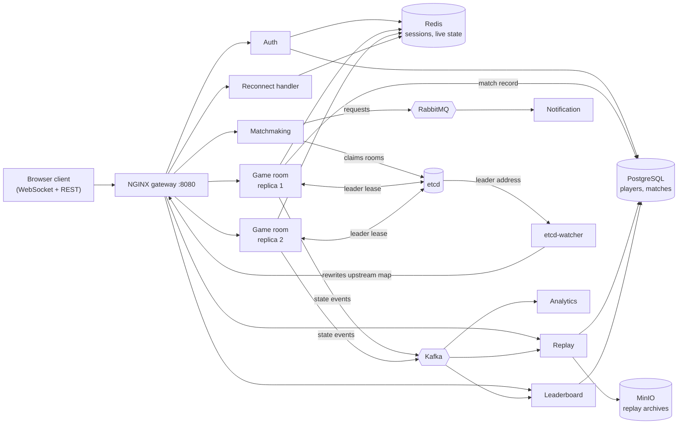

# Distributed Real-Time Multiplayer Platform

[](https://github.com/thorOdinson16/multiplayer-infra/actions/workflows/ci.yml)

A multiplayer arena game backend built as nine cooperating microservices. Game rooms run as replicas
behind an **etcd leader election**: kill the leader and another replica takes over and the match keeps
ticking, in about **5 seconds** (measured, see [engineering notes](docs/engineering-notes.md#measurements)). Player state flows
through Kafka, Redis and PostgreSQL, and every service is traced end to end.

## What it demonstrates

- **Fault tolerance you can see.** Hard-kill the leader container; a follower wins the etcd lease,
  rebuilds state from Redis (or replays Kafka if Redis is gone) and resumes the match.
- **Event-driven design with the right tool per job.** Kafka for the ordered event log, RabbitMQ for
  work queues, Redis for hot state, PostgreSQL for durable data. See [architecture and design decisions](docs/architecture.md#design-decisions).
- **Correctness under concurrency.** Atomic, idempotent Elo updates; unique constraints instead of
  check-then-insert; at-least-once Kafka handling with offsets committed after success.
- **Observability from day one.** OpenTelemetry traces to Jaeger, Prometheus metrics on every service,
  Grafana dashboards.
- **Tested against the real stack.** CI starts the full compose environment and runs end-to-end,
  failover, hold-slot and telemetry checks. [What went wrong along the way](docs/engineering-notes.md#lessons-learned).

## Architecture



**A match, step by step**

1. A player registers or logs in; Auth issues an RS256 JWT and records the session in Redis.
2. The player joins the matchmaking queue (RabbitMQ). The matcher groups players by Elo, widening
   the allowed range the longer someone waits, and claims a room through etcd.
3. The replicas of that room race for an etcd lease; the winner becomes leader and runs the game
   loop at 20 ticks per second.
4. Each tick: publish the state event to Kafka and wait for the acknowledgement, then advance state
   and write Redis, then broadcast to players and (delayed) spectators.
5. If the leader dies, its lease expires, a follower is elected, loads state from Redis or replays
   Kafka, and the match continues. A reconnecting player gets their slot back for 30 seconds.
6. When the match ends, the lifecycle event on Kafka triggers the Leaderboard (Elo and stats in one
   transaction) and the Replay service (archive to MinIO). The room then starts its next match.

## Quick start

Requires Docker with Compose v2 and about 8 GB of free RAM.

```bash
docker compose up --build -d     # first run takes a few minutes
docker compose ps                # wait until services are healthy (~90 s)
open http://localhost:3000       # game client
```

No configuration is needed; every credential has a local-development default (see `.env.example`).
Open the client in two browser tabs, register two players, click **Join Matchmaking** in both, then
move with WASD and shoot with a click. Try the failover yourself while a match is running:

```bash
docker kill $(docker ps --filter name=game-room-1 -q)    # or game-room-2-1; whichever leads
```

| UI | URL |
|---|---|
| Game client | http://localhost:3000 |
| Grafana | http://localhost:3001 (admin / admin) |
| Jaeger traces | http://localhost:16686 |
| Prometheus | http://localhost:9090 |
| RabbitMQ | http://localhost:15672 (guest / guest) |
| MinIO console | http://localhost:9001 (minioadmin / minioadmin) |

## Measured results

| | result |
|---|---|
| Leader failover (10 hard kills) | median **5.1 s** to a new leader, **5.2 s** until the match ticks again, worst 6.9 s |
| Tick rate under load | holds the 20 Hz target (p50 50 ms) up to 50 players in one room |
| Capacity of one room | about 100 players before the median tick slips to ~63 ms |

Failover time is dominated by the 5-second etcd lease TTL. Method, caveats and analysis are in
[docs/engineering-notes.md](docs/engineering-notes.md#measurements).

## Services

| Service | Port | Role |
|---|---|---|
| NGINX gateway | 8080 | REST and WebSocket entry point, rate limiting, CORS |
| Auth | 8001 | Register, login, JWT validation and revocation; players in PostgreSQL, sessions in Redis |
| Matchmaking | 8002 | Consumes the RabbitMQ queue, Elo-based grouping, claims rooms via etcd |
| Game room (x2) | 8003, 8009 | Leader-elected game loop, Kafka publishing, Redis state, WebSocket server |
| Replay | 8004 | Archives match events to MinIO, serves and seeks replays, stores checkpoints |
| Leaderboard | 8005 | Applies Elo and stats from match results, serves rankings |
| Analytics | 8006 | Aggregates telemetry from Kafka into Prometheus metrics |
| Notification | 8007 | Pushes match events to clients over WebSocket |
| Reconnect handler | 8008 | Restores a player's state after a disconnect |
| etcd-watcher | internal | Keeps NGINX's upstream map pointed at the current leader |

## Testing

```bash
# Unit tests (per service)
pip install pytest pytest-asyncio httpx -r services/auth/requirements.txt -r services/leaderboard/requirements.txt
python -m pytest services/auth/app services/leaderboard/app

# Against a running stack (docker compose up -d first)
bash scripts/test_end_to_end.sh        # health of every service, auth, leaderboard, queue, metrics
bash scripts/test_failover.sh          # kill the leader, match must resume
bash scripts/test_failover_timing.sh   # recovery within 8 s
bash scripts/test_hold_slot.sh         # position survives a disconnect
bash scripts/test_telemetry.sh         # events reach Kafka
```

CI runs lint (including unused and undefined names), the unit tests, a Docker build of every image,
a Helm render, and then the full-stack scripts above.

## Known limitations

- **One room tops out around 100 players.** Each tick sends full state to every client. Deltas, a binary
  format and interest management would raise that; more rooms scale horizontally.
- **Failover takes about 5 seconds** because of the lease TTL (a deliberate trade-off, see
  [architecture](docs/architecture.md#2-leader-election-with-etcd-leases)).
- **Matchmaking's queue is in memory.** Requests already pulled from RabbitMQ are lost if matchmaking
  restarts.
- **Replay seek reads the whole archive** to return a page of events.
- **Elo is basic:** a fixed K-factor of 32 and pairwise comparison by score, with no rating uncertainty.
- **Local credentials are hardcoded defaults.** The Helm chart uses plain values and an `emptyDir` for
  Postgres; real deployments need Secrets and a persistent volume.
- **No TLS between services.**
- **MinIO runs from `bitnamilegacy/minio`**, a frozen image, because upstream stopped publishing images.

## Repository layout

```
client/            Node.js game client (Express + Canvas)
services/          the microservices (FastAPI); each has its own Dockerfile and requirements
infra/nginx/       gateway configuration (upstream map is generated by etcd-watcher)
infra/kubernetes/  Kubernetes manifests
infra/helm/        Helm chart (includes a copy of the database schema)
monitoring/        Prometheus, OpenTelemetry collector, Grafana provisioning
scripts/           database schema, Kafka/RabbitMQ setup, tests, benchmarks
docs/              architecture and design decisions; benchmarks and lessons learned
```
